# Hydration Kit For Windows Server 2022, SQL Server 2019 and ConfigMgr Current Branch

This kit builds a complete **ConfigMgr Current Branch 2111** infrastructure running on **Windows Server 2022** and **SQL Server 2019**, including optional **Windows 10** and **Windows 11** clients. This kit is tested on both Hyper-V and VMware virtual platforms, but should work fine on other virtualization platforms like Virtual Box, KVM etc.

- [Hydration Kit For Windows Server 2022, SQL Server 2019 and ConfigMgr Current Branch](#hydration-kit-for-windows-server-2022-sql-server-2019-and-configmgr-current-branch)
  - [Notes](#notes)
  - [Hydration Kit For Windows Server 2022 and ConfigMgr Current Branch](#hydration-kit-for-windows-server-2022-and-configmgr-current-branch)
    - [Servers](#servers)
      - [Main servers](#main-servers)
      - [Optional supporting servers](#optional-supporting-servers)
    - [Clients](#clients)
  - [Setup Overview](#setup-overview)
  - [Step-by-Step Guides](#step-by-step-guides)
    - [Step 1: Download the software](#step-1---download-the-software)
      - [Optional Servers](#optional-servers)
      - [Optional Clients](#optional-clients)
    - [Step 2: Install the Hydration Kit](#step-2---install-the-hydration-kit)
      - [Installing Hydration Kit Prerequisites](#installing-hydration-kit-prerequisites)
        - [Installing the Hydration Kit](#installing-the-hydration-kit)
    - [Step 3: Copy the downloaded software to the Hydration Kit](#step-3---copy-the-downloaded-software-to-the-hydration-kit)
      - [Optional: Populate the hydration deployment share with files for MDT01](#optional---populate-the-hydration-deployment-share-with-files-for-mdt01)
    - [Step 4: Create the bootable Hydration Kit ISO (MDT offline media item)](#step-4---create-the-bootable-hydration-kit-iso-mdt-offline-media-item)
    - [Step 5: Create and Deploy the virtual machines](#step-5---create-and-deploy-the-virtual-machines)
  - [Optional Post-ConfigMgr Install Tasks](#next-steps---optional-post-configmgr-install-tasks)
  - [Customizing the Hydration Kit](#next-steps---customizing-the-hydration-kit)

Download from GitHub: <https://github.com/DeploymentResearch/HydrationKitWS2022>

**Hydration Kit Video:** Check out the free mini course at the ViaMonstra Online Academy covering the Hydration Kit setup (and many other tips and tricks related for creating a lab for ConfigMgr, MDT and Intune): [Building the Perfect Lab for ConfigMgr, MDT, and Intune](https://academy.viamonstra.com/courses/mini-course-building-the-perfect-lab-for-configmgr-mdt-and-intune).

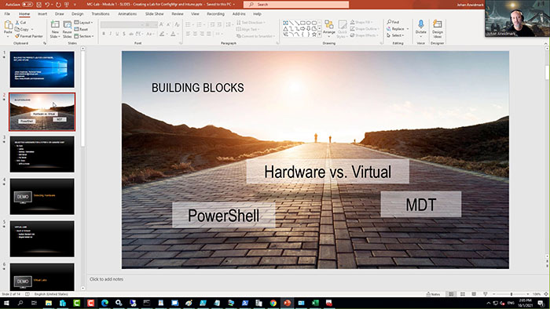

*Sample screenshot from the free mini course on ViaMonstra Online Academy.*

**Credits:** Special thanks to [Sven Aelterman](https://www.linkedin.com/in/svenaelterman) for creating the script for configuring SQL Server Reporting Services, and for graciously allowing me to include it in the hydration kit.

## Notes

**Customizations:** This hydration kit install all servers in the corp.viamonstra.com domain, on the 192.168.25.0/24 network. If you rather use your own domain, different IP addresses etc. check out the ***Next Step - Customizing the Hydration Kit*** section in the end of this post for instructions on how to customize this kit. That being said, I recommend getting to know the kit using the default names if you can.

**Internal network and Internet Access:** Since one of the virtual machines (DC01) is also a DHCP Server, its highly recommended to deploy the virtual machines on an internal virtual network, and then use the NAT feature in either Hyper-V or VMware to give the virtual machines Internet access. For super-easy Internet access on Hyper-V, while still having the VMs on an isolated network, read this shiny post from [Ami Arwidmark (@AArwidmark)](https://twitter.com/AArwidmark):

- Setting Up New Networking Features in Hyper-V for Windows 10 or Windows Server 2016/2019\
    <https://deploymentresearch.com/558/Setting-Up-New-Networking-Features-in-Server-2016>.

**Advanced networking:** For more complex networks (multiple sites, bandwidth throttling etc.), you may want to use a virtual router. More info here:

- Using a virtual router for your lab and test environment\
    <https://deploymentresearch.com/285/Using-a-virtual-router-for-your-lab-and-test-environment>

**Hydration Kit Archive:** Are you looking for the previous hydration kits for Windows Server 2016 or Windows Server 2019? Look no further, they are right here:

- Hydration Kit for Windows Server 2016 and ConfigMgr Current / Technical Preview Branch\
    <https://deploymentresearch.com/hydration-kit-for-windows-server-2016-and-configmgr-current-technical-preview-branch/>
- Hydration Kit for Windows Server 2019 and ConfigMgr Current Branch\
    <https://www.deploymentresearch.com/hydration-kit-for-windows-server-2019-sql-server-2017-and-configmgr-current-branch/>

## Hydration Kit for Windows Server 2022 and ConfigMgr Current Branch

So, again, this Kit builds a complete ConfigMgr Current Branch 2111, with Windows Server 2019 and SQL Server 2019 infrastructure, and some supporting servers. Once the build is complete, I recommend that you use the native ConfigMgr servicing option to update to latest release or Hotfix if available.

### Servers

This kit allows you to automatically deploy the below list of servers. The server you really need to build first is DC01, since that's the domain controller, and the CM01 server will join the domain. Turns out joining a domain is tricky without a domain controller. :)

#### Main servers

- **DC01**. Windows Server 2022, DC, DHCP and DNS
- **CM01**. Windows Server 2022, SQL Server 2019, and ConfigMgr Current Branch

#### Optional supporting servers

- **MDT01**. Windows Server 2022, SQL Server 2019 Express, and MDT 8456
- **FS01**. Windows Server 2022, File Server
- **DP01**. Windows Server 2022, additional ConfigMgr DP

### Clients

This kit also allows you to automatically deploy the below list of clients for management.

- **PC001**. Windows 10 Enterprise
- **PC002**. Windows 10 Enterprise
- **PC003**. Windows 11 Enterprise
- **PC004**. Windows 11 Enterprise

## Setup Overview

Shorthand, to build the virtual machines there are five main steps you need to do:

1. Download the necessary software
2. Install the Hydration Kit
3. Copy the downloaded software to the Hydration Kit
4. Create the bootable Hydration Kit ISO
5. Create and Deploy the virtual machines

>**Note:** Detailed instructions are further down this page... See the **Step-by-Step Guides** section.

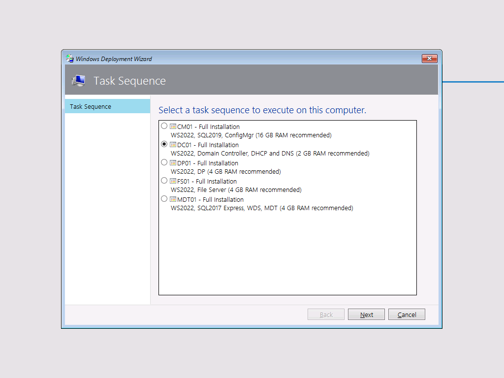

*The Deployment Wizard displaying the available task sequences.*

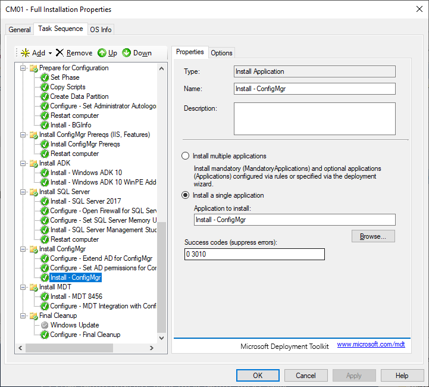

*The CM01 task sequence, building a complete ConfigMgr site server with SQL Server.*

## Step-by-Step Guides

## Step 1 - Download the software

On the Windows machine (client or server, 64 bit) that you use to manage Hyper-V or VMware, create a folder for all the software needed, for example **C:\Setup**.

Then, for the main servers (DC01 and CM01), you need to download the following software:

- The Hydration Kit: <https://github.com/DeploymentResearch/HydrationKitWS2022>
- MDT 8456 (The kit is based on that platform): <https://www.microsoft.com/en-us/download/details.aspx?id=54259>
- MDT 8456 Hotfix: <https://download.microsoft.com/download/3/0/6/306AC1B2-59BE-43B8-8C65-E141EF287A5E/KB4564442/MDT_KB4564442.exe>
- BGInfo: [http://technet.microsoft.com/en-us/sysinternals/bginfo](https://technet.microsoft.com/en-us/sysinternals/bginfo)
- A Windows Server 2022 Standard WIM image (single index, fully updated). The easiest way to get one is to download an already updated Windows Server 2022 ISO file, and then run this PowerShell script: <https://github.com/DeploymentResearch/DRFiles/blob/master/Scripts/Export-WindowsServer2022WIMfromISO.ps1>
- SQL Server 2019 Standard x64: Either a fully licensed version from VLSC or MSDN, or a 180 days trial version from the Microsoft Evaluation Center: <https://www.microsoft.com/en-us/evalcenter/>
- SQL Server 2019 Cumulative Update (CU) 14 (or later): [https://www.microsoft.com/en-us/download/details.aspx?id=100809](https://www.microsoft.com/en-us/download/details.aspx?id=100809) (ConfigMgr only requires CU 5 for SQL Server 2019, but I recommend using the latest CU).
- SQL Server 2019 Reporting Services: <https://www.microsoft.com/en-us/download/details.aspx?id=100122>
- SQL Server Management Studio: <https://aka.ms/ssmsfullsetup>
- Microsoft ODBC Driver 18 for SQL Server (x64): <https://learn.microsoft.com/en-us/sql/connect/odbc/download-odbc-driver-for-sql-server>
- ConfigMgr 2403 and its prerequisites: Either a fully licensed version from VLSC or MSDN, or a 180 days trial version from the Microsoft Evaluation Center: <https://www.microsoft.com/en-us/evalcenter/evaluate-microsoft-endpoint-configuration-manager>

>**Note:** To download the ConfigMgr prerequisites, you run the **SMSSETUP\BIN\X64\setupdl.exe** application from the ConfigMgr installation files and simply provide a folder for the download.

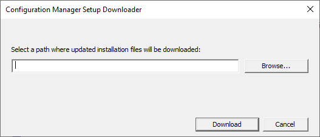

*Running setupdl.exe to download ConfigMgr pre-requisites.*

Windows ADK for Windows 11and the ADK WinPE Addon for Windows 11: <https://docs.microsoft.com/en-us/windows-hardware/get-started/adk-install>

**Note #1:** Make sure to get the 22H2 version of the Windows ADK for Windows 11 (10.1.22621.1), not the new 23H2 version (10.1.25398.1, released in September 2023).

More information can be found in this blog post: [https://www.deploymentresearch.com/windows-11-deployment-using-mdt-8456-with-windows-adk-23h2-build-25398/](https://www.deploymentresearch.com/windows-11-deployment-using-mdt-8456-with-windows-adk-23h2-build-25398/)

**Note #2:** To download the complete standalone Windows ADK for Windows 11 setup, run **adksetup.exe /layout "C:\Setup\Windows ADK 11**" for the core ADK, and then **adkwinpesetup.exe /layout "C:\Setup\Windows ADK 11 WinPE Addon"** for the WinPE Addon.

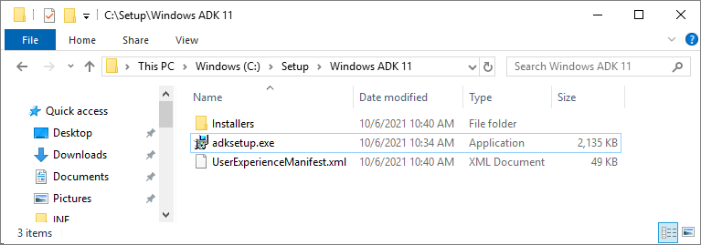

*Windows ADK 11 setup files.*

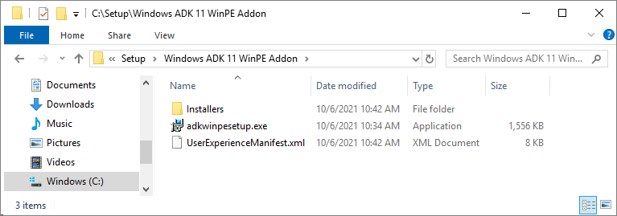

*The Windows ADK 11 WinPE Addon files.*

### Optional Servers

The FS01 and DP01 optional servers don't need any extra software, but for the MDT01 server, you also need to download the following software:

- SQL Server 2019 Express: <https://www.microsoft.com/en-us/Download/details.aspx?id=101064>

>**Note:** Use the SQL2019-SSEI-Expr.exe web installer to download the Express Core media (SQLEXPR_x64_ENU.exe)

![Using the SQL2019-SSEI-Expr.exe web installer to download media.(docs/Downloading-SQL-Server-2019-Express-from-web-installer.png)

*Using the SQL2019-SSEI-Expr.exe web installer to download media.*

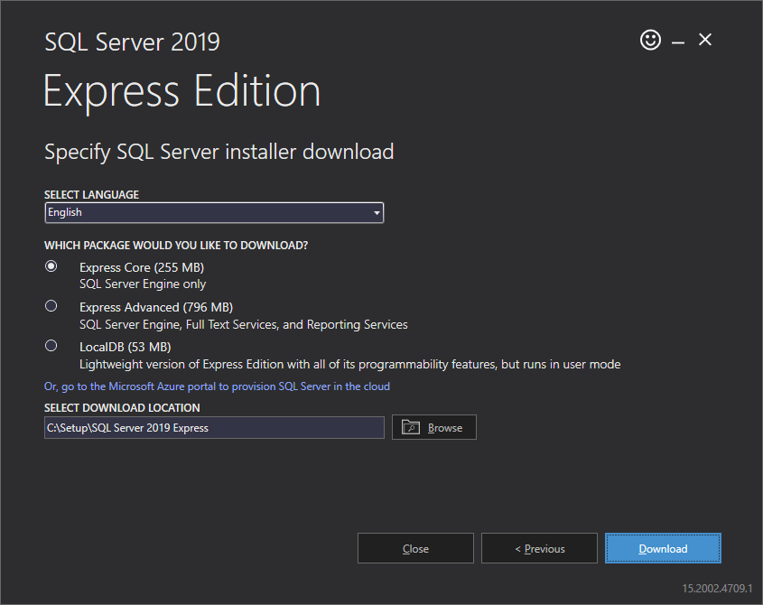

*Selecting the Express Core version.*

### Optional Clients

For the optional clients, you also need to download the following software:

- A Windows 10 Enterprise WIM image (single index, fully updated). The easiest way to get one is to download an already updated Windows 10 ISO file, and then run this PowerShell script: <https://github.com/DeploymentResearch/DRFiles/blob/master/Scripts/Export-Windows10EnterpriseWIMFromISO.ps1>
- A Windows 11 Enterprise WIM image (single index, fully updated). The easiest way to get one is to download an already updated Windows 11 ISO file, and then run this PowerShell script: <https://github.com/DeploymentResearch/DRFiles/blob/master/Scripts/Export-Windows11EnterpriseWIMFromISO.ps1>

## Step 2 - Install the Hydration Kit

Installing the Hydration Kit requires that you first install Windows ADK and the Windows ADK WinPE Addon. The kit has been tested with both Windows ADK 10 and Windows ADK 11, but to get full support for Windows 11, I recommend using the Windows ADK 11 version since it supports all currently supported operating systems.

### Installing Hydration Kit Prerequisites

1\. On the Windows machine that you use to manage Hyper-V or VMware, install **Windows ADK 11** (adksetup.exe) selecting only the following components:

- **Deployment Tools**
- **Imaging and Configuration Designer (ICD)**
- **Configuration Designer**
- ****User State Migration Tool (USMT)****

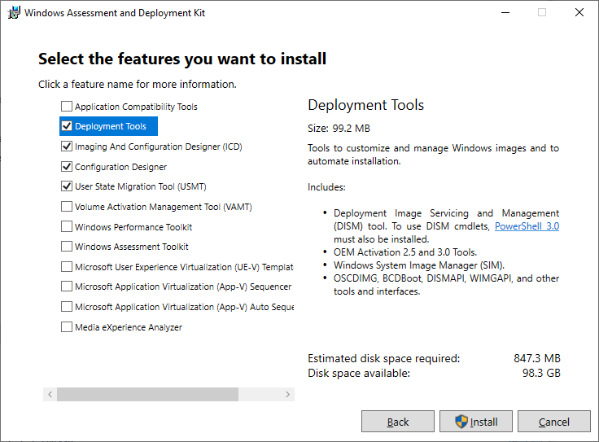

*Running the Windows ADK 11 Setup.*

>**Note:** The last three are not used by the hydration kit, but are still quite useful to have, so I usually install them too.  

2\. Install **Windows ADK 11 WinPE Addon** (adkwinpesetup.exe) with the default settings.

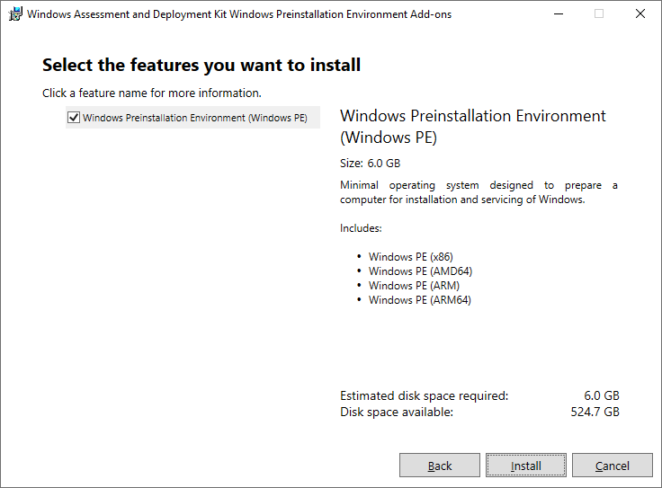

*Running the Windows ADK 11 WinPE Addon Setup.*

**Note:** Because the Windows ADK for Windows 11 does not include the 32-bit (x86) version of Windows PE, you'll need to create an empty x86\WinPE_OCs folder structure in the Windows ADK folder. MDT doesn't use, but still looks for, this directory.

More information can be found in this blog post: [https://www.deploymentresearch.com/windows-11-deployment-using-mdt-8456-with-windows-adk-23h2-build-25398/](https://www.deploymentresearch.com/windows-11-deployment-using-mdt-8456-with-windows-adk-23h2-build-25398/)

3\. Install **MDT 8456** (MicrosoftDeploymentToolkit_x64.msi) with the default settings.

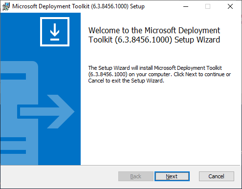

*Running the MDT 8456 Setup.*

4\. Install the **MDT 8456 HotFix**.

>**Note:** Due to a code change in Windows 10 2004 or later (including Windows 11 and Windows Server 2022), and Windows ADK 10 2004 and later, you need to download some updated files for MDT 8456. You can download these files here: <https://download.microsoft.com/download/3/0/6/306AC1B2-59BE-43B8-8C65-E141EF287A5E/KB4564442/MDT_KB4564442.exe>

4a. Download the **MDT 8456 HotFix**(MDT_KB4564442.exe), and extract it to a folder. I extracted it to **C:\Setup\MDT 8456 HotFix**.

4b. Copy the x86 version of the new **Microsoft.BDD.Utility.dll** from **C:\Setup\MDT 8456 HotFix\x86** to **C:\Program Files\Microsoft Deployment Toolkit\Templates\Distribution\Tools\x86**. Replace the existing file.

4c. Copy the x64 version of the new **Microsoft.BDD.Utility.dll** from **C:\Setup\MDT 8456 HotFix\x64** to **C:\Program Files\Microsoft Deployment Toolkit\Templates\Distribution\Tools\x64**. Replace the existing file.

#### Installing the Hydration Kit

1\. Extract the content from the Hydration Kit download to a folder, for example **C:\Setup\HydrationKit**.

The folder you used should now have a sub-folder named Source, two PowerShell scripts, a readme file and a license file.

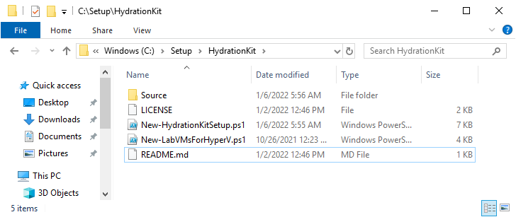

*The extracted hydration kit files.*  

2\. In an elevated **PowerShell command** prompt, navigate to the ****C:\Setup\HydrationKit**** folder, and create the hydration deployment share by running the following command:

`.\New-HydrationKitSetup.ps1 -Path C:\CMLab -ShareName CMLab`

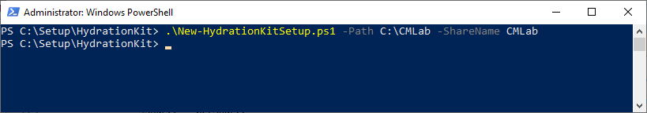

*Running the New-HydrationKitSetup.ps1 script.*

3\. Open the **Deployment Workbench**, and look around. You should see applications, operating systems, and task sequences etc.

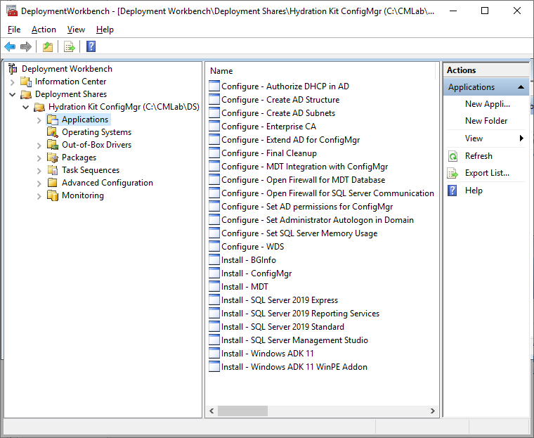

*Opening the Hydration Kit deployment share in Deployment Workbench.*

## Step 3 - Copy the downloaded software to the Hydration Kit

Next step is to start copying the various installation files to the correct folder.

1\. Copy your **Windows Server 2022 reference image** (have to be named **REFWS2022-001.wim**, case sensitive), to the following folder: **C:\CMLab\DS\Operating Systems\WS2022**

**Note #1:** The WIM image should only have a single index with the **Windows Server 2022 with Desktop Experience** edition. Please use the script to extract the correct index from a Windows Server 2022 ISO file.

**Note #2:** If your VMs does not have Internet access during the Hydration Kit build, make sure to also copy the **microsoft-windows-netfx3-ondemand-package~31bf3856ad364e35~amd64~~.cab** file to the following folder: **C:\CMLab\DS\Operating Systems\WS2022\sources\sxs**. Failing to do so will prevent .NET Framework 3.5 from being installed if the VM does not have Internet access.

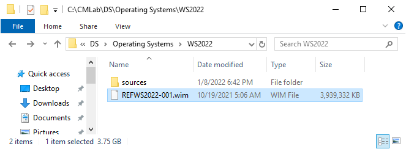

*The Windows Server 2022 Standard image copied.*

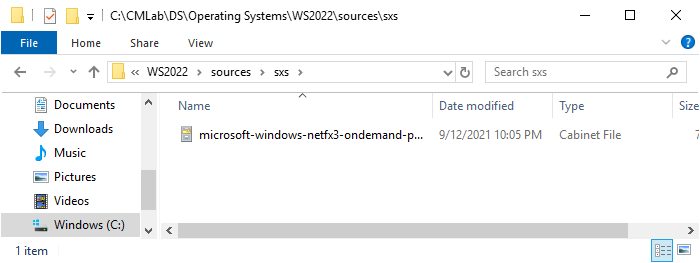

*.NET Framework 3.5 copied*

2\. Copy the **BGInfo** file (bginfo.exe) to the following folder: **C:\**CMLab\**DS\Applications\Install - BGInfo\Source**

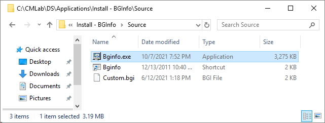

*BGInfo copied.*

3\. Copy the **Windows ADK 11** setup files (1.6 GB) to the following folder:\
**C:\CMLab\DS\Applications\Install - Windows ADK 11\Source**

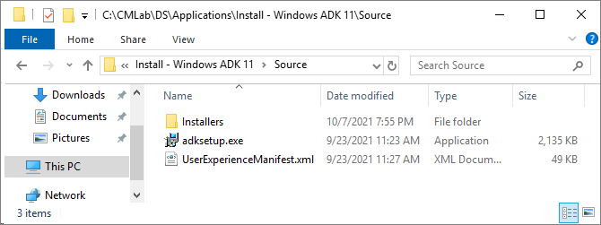

*The Windows ADK 11 setup files copied.*

4\. Copy the **Windows ADK 11 WinPE Addon** setup files (3 GB) to the following folder:\
**C:\CMLab\DS\Applications\Install - Windows ADK 11 WinPE Addon\Source**

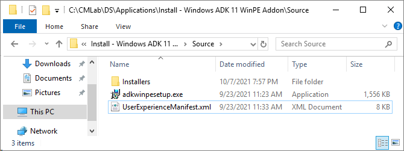

*Windows ADK 11 WinPE Addon setup files copied.*

5\. Copy the **SQL Server 2019 Standard x64** setup files (the content of the ISO, not the actual ISO) to the following folder:\
**C:\CMLab\DS\Applications\Install - SQL Server 2019 Standard\Source**

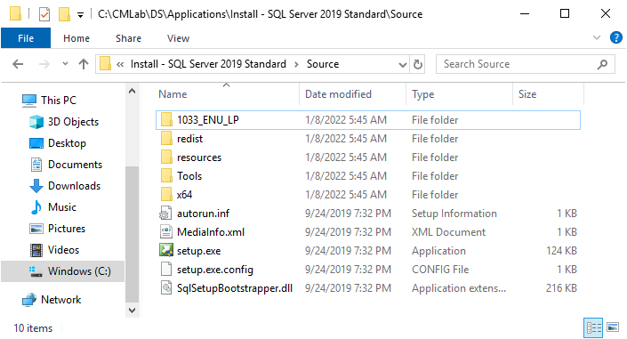

*SQL Server 2019 Standard x64 setup files copied.*

6\. In the **C:\CMLab\DS\Applications\Install - SQL Server 2019 Standard\Source** folder, create a subfolder named **Updates**, and copy thelatest **SQL Server 2019 CU** setup file to it (CU 14 when I wrote this guide).

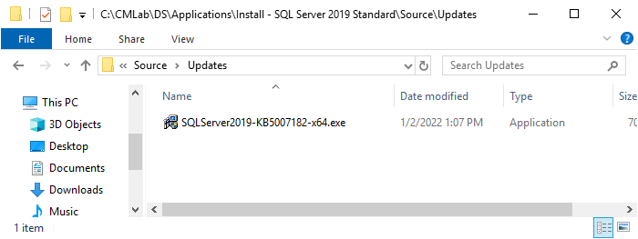

*The SQL Server 2019 CU copied to Updates folder.*

7\. Copy the **SQL Server Management Studio** setup file to the following folder:\
**C:\CMLab\DS\Applications\Install - SQL Server Management Studio**

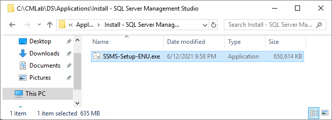

*The SQL Server Management Studio setup file copied.*

8\. Copy the **SQL Server 2019 Reporting Services** setup file to the following folder:\
**C:\CMLab\DS\Applications\Install - SQL Server 2019 Reporting Services\Source**

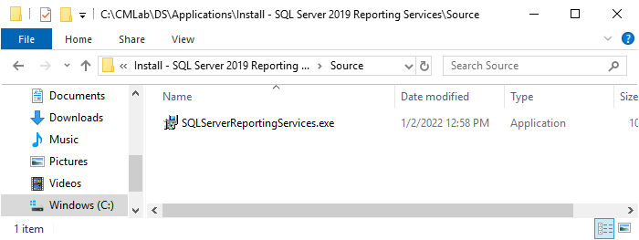

*SQL Server Reporting Services setup files copied.*

9\. Copy the **Microsoft ODBC Driver 18 for SQL Server (x64)** setup file to the following folder:\
**D:\CMLab\DS\Applications\Install - Microsoft ODBC Driver 18**

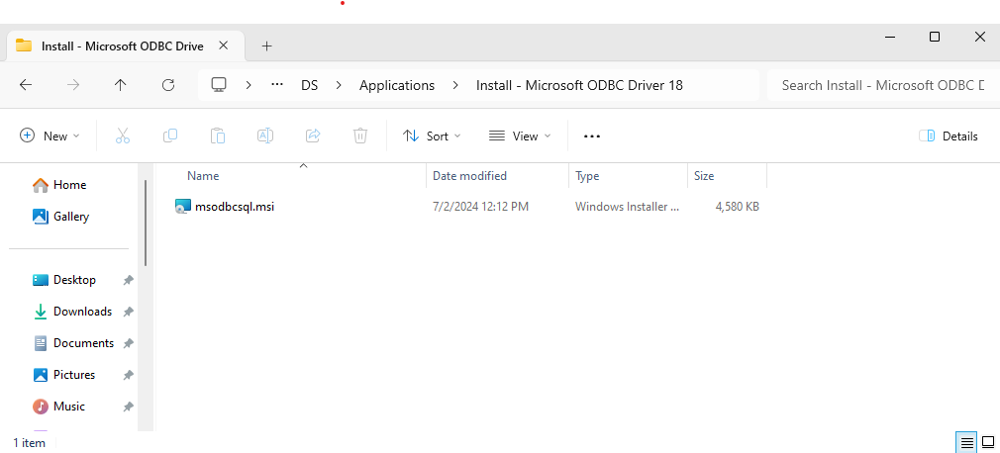

*Microsoft ODBC Driver 18 for SQL Server (x64)setup files copied.*

10\. Copy the **ConfigMgr 2403** setup files (extract the download) to the following folder:\
**C:\CMLab\DS\Applications\Install - ConfigMgr\Source**

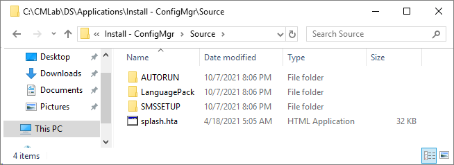

*ConfigMgr setup files copied.*

11\. Copy the **ConfigMgr 2403 PreReqs** setup files to the following folder:\
**C:\CMLab\DS\Applications\Install - ConfigMgr\PreReqs**

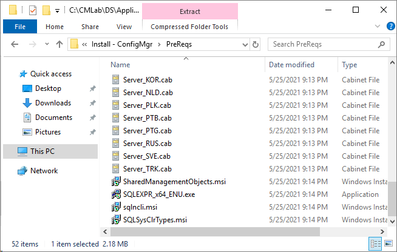

*ConfigMgr Pre-requisite files copied, showing a subset of the files.*

12\. Copy your **Windows 10 reference image** (must be named **REFW10X64-001.wim**, case sensitive), to the following folder: **C:\CMLab\DS\Operating Systems\Windows 10**

**Note #1:** The WIM image should only have a single index with the **Windows 10 Enterprise** edition. Please use the script to extract the correct index from a Windows 10 ISO file.

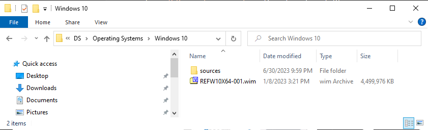

*The Windows 10 Enterprise image copied.*

13\. Copy your **Windows 11 reference image** (must be named **REFW11X64-001.wim**, case sensitive), to the following folder: **C:\CMLab\DS\Operating Systems\Windows 11**

**Note #1:** The WIM image should only have a single index with the **Windows 11 Enterprise** edition. Please use the script to extract the correct index from a Windows 11 ISO file.

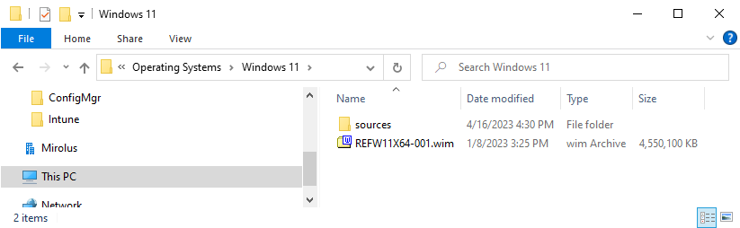

*The Windows 11 Enterprise image copied.*

### Optional - Populate the hydration deployment share with files for MDT01

>**Note:** These steps are only needed if you want to deploy the optional MDT01 virtual machine. If you don't need this VM, simply skip to the next section: "Create the Hydration Kit ISO (MDT offline media item)"

1\. Copy the SQL Server 2019 Express setup file (SQLEXPR_x64_ENU.exe) to the following folder:\
**C:\CMLab\DS\Applications\Install - SQL Server 2019 Express\Source**

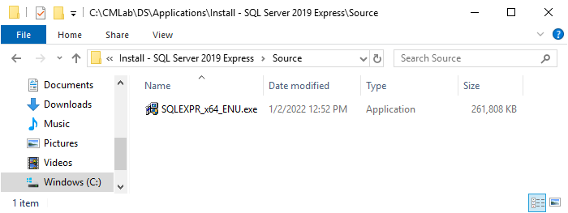

*SQL Server 2019 Express setup file copied.*

2.\. Copy the **MDT 8456** setup file (MicrosoftDeploymentToolkit_x64.msi) to the following folder:\
**C:\CMLab\DS\Applications\Install - MDT**

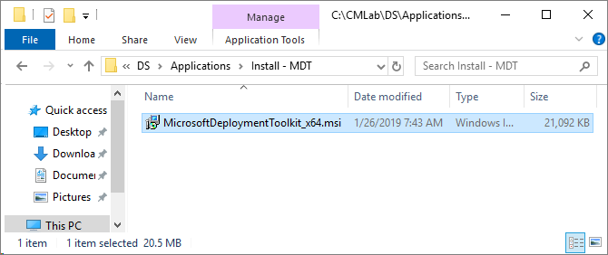

*MDT 8456 copied.*

## Step 4 - Create the bootable Hydration Kit ISO (MDT offline media item)

1\. Using **Deployment Workbench** (available on the Start screen), expand **Deployment Shares**, and expand **Hydration ConfigMgr**.

2\. Expand the **Advanced Configuration** node, and then select the **Media** node.

3\. In the right pane, right-click the **MEDIA001** item, and select **Update Media Content**.

>**Note:** The media update will take a while to run, a perfect time for a coffee break.

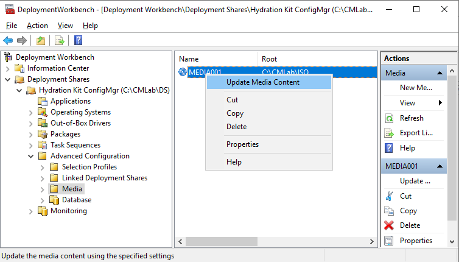

*Creating the bootable Hydration Kit ISO file.*

After the media update you will have a big ISO (HydrationCMWS2022.iso) in the C:\CMLab\ISO folder. The HydrationCMWS2022.iso should be about 14-16 GB in size (size will vary a bit depending on your Windows Server 2022 image and software added).

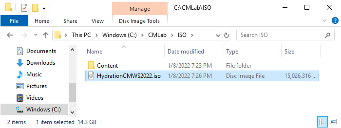

*The Hydration Kit ISO file.*

## Step 5 - Create and Deploy the virtual machines

First, all accounts, including Administrator, have a password of **P@ssw0rd**. Secondly, you either create your VM manually, and connect them to the Hydration Kit ISO. Or you can automate that process to with a bit of PowerShell.

### Creating the Virtual Machines via PowerShell

If you want a PowerShell script that creates these VMs for Hyper-V, use **New-LabVMsForHyperV.ps1** script from the **C:\Setup\HydrationKit** folder. The syntax for the scripts is as follows:

`.\New-LabVMsForHyperV.ps1 -VMLocation C:\VMs -VMNetwork Internal -ISO C:\CMLab\ISO\HydrationCMWS2022.iso`

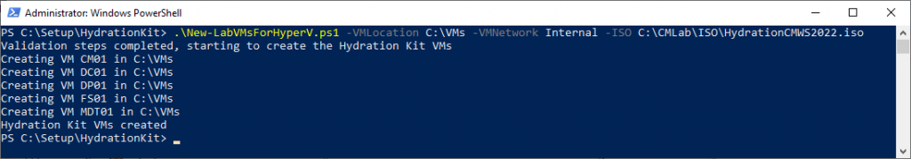

*Running the New-LabVMsForHyperV.ps1 script.*

>**Note:** If using Hyper-V, do **Not** configure the virtual machines for dynamic memory. If you do, the installation will take a very long time. Dynamic memory can be enabled when installation (hydration) is completed.

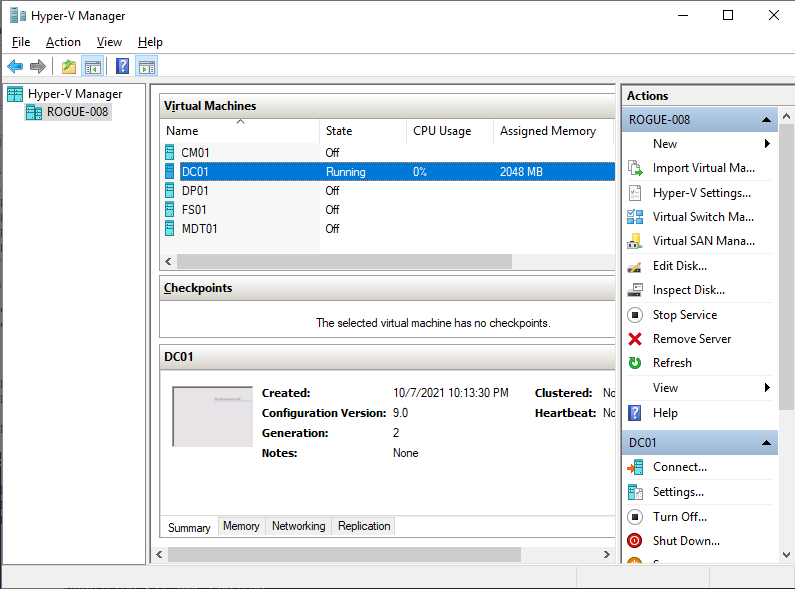

*Virtual Machines created via the New-LabVMsForHyperV.ps1 script.*

#### **Deploying DC01**

Using **Hyper-V Manager** or **VMware Workstation/Sphere**, create a virtual machine with the following settings:

- Name: **DC01**
- CPU: **2 vCPU**
- Hard drive: **100 GB** (dynamic disk)
- Memory: **2 GB** (static memory)
- Network: **Your lab network**
- Image file (ISO): **C:\CMLab\ISO\HydrationCMWS2022.iso**

1. Start the **DC01** virtual machine. After booting from **HydrationCMWS2022.iso** , and after WinPE has loaded, select the **DC01** task sequence.
2. Wait until the setup is complete and you see the **Hydration Complete** message in the final summary.
3. Leave **DC01** running while deploying the **CM01 virtual machine.**

#### **Deploying CM01**

Once the domain controller (DC01) is up and running, you can deploy the CM01 virtual machine. Don't forget to leave DC01 running while deploying CM01 since it is joining the domain during deployment. Use the following settings for the CM01 virtual machine:

- Name: **CM01**
- CPU: **4 vCPU**
- Hard drive: **300 GB** (dynamic disk)
- Memory: **16 GB** (static memory)
- Network: **Your lab network**
- Image file (ISO): **C:\CMLab\ISO\HydrationCMWS2022.iso**

#### Post configuration of CM01

After deploying **CM01**, make sure the machine has access to Internet. Again either via [Configure NAT in Hyper-V](https://deploymentresearch.com/558/Setting-Up-New-Networking-Features-in-Server-2016) or VMware, or by [setting up a virtual router](https://deploymentresearch.com/285/Using-a-virtual-router-for-your-lab-and-test-environment).

Then, in the **Administration workspace**, in the **Updates and Servicing** node. Click **Check for Updates**, and then install the latest updates available. Don't forget to do a final reboot after applying the updates, there is usually a pending reboot caused by the upgrade process.

#### **Deploying MDT01 (Optional)**

Once the domain controller (DC01) is up and running, you can deploy the optional MDT01 virtual machine. Don't forget to leave DC01 running while deploying MDT01 since it is joining the domain during deployment. Use the following settings for the MDT01 virtual machine:

- Name: **MDT01**
- CPU: **2 vCPU**
- Hard drive: **300 GB** (dynamic disk)
- Memory: **4 GB** (static memory)
- Network: **Your lab network**
- Image file (ISO): **C:\CMLab\ISO\HydrationCMWS2022.iso**

#### **Deploying DP01 (Optional)**

Once the domain controller (DC01) is up and running, you can deploy the optional DP01 virtual machine. Don't forget to leave DC01 running while deploying DP01 since it is joining the domain during deployment. Use the following settings for the DP01 virtual machine:

- Name: **DP01**
- CPU: **2 vCPU**
- Hard drive: **300 GB** (dynamic disk)
- Memory: **4 GB** (static memory)
- Network: **Your lab network**
- Image file (ISO): **C:\CMLab\ISO\HydrationCMWS2022.iso**

#### **Deploying FS01 (Optional)**

Once the domain controller (DC01) is up and running, you can deploy the optional FS01 virtual machine. Don't forget to leave DC01 running while deploying FS01 since it is joining the domain during deployment. Use the following settings for the FS01 virtual machine:

- Name: **FS01**
- CPU: **2 vCPU**
- Hard drive: **300 GB** (dynamic disk)
- Memory: **4 GB** (static memory)
- Network: **Your lab network**
- Image file (ISO): **C:\CMLab\ISO\HydrationCMWS2022.iso**

#### **Deploying PC0001-4 (Optional)**

Once the domain controller (DC01) is up and running, you can deploy the optional PC0001-4 virtual machine(s). Don't forget to leave DC01 running while deploying PC0001-4 since they are joining the domain during deployment. Use the following settings for the PC0001-4 virtual machine(s):

- Name: **PC0001** / **PC0002** / **PC0003** / **PC0004**
- CPU: **2 vCPU**
- Hard drive: **60 GB** (dynamic disk)
- Memory: **4 GB** (static memory)
- Network: **Your lab network**
- Image file (ISO): **C:\CMLab\ISO\HydrationCMWS2022.iso**

## Next Steps - Optional Post-ConfigMgr Install Tasks

This kit has pre-configured steps that can automatically install Configuration Manager roles depending on the goals for your lab. These steps are disabled by default and if no customizations were made to the kit, they can be enabled without adjustment.

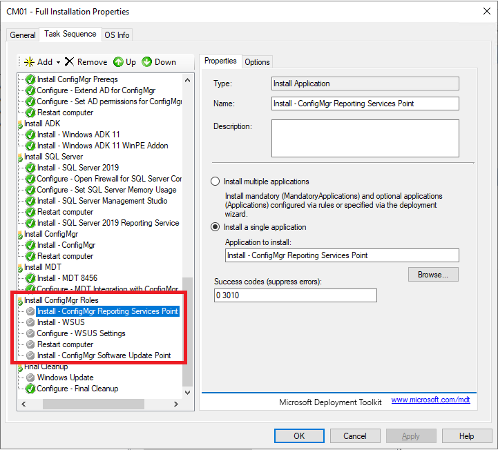

*Optional Post-ConfigMgr Install Tasks*

Currently, the kit supports the following tasks:

- Reporting Services Point
- Software Update Point

Reporting Services Point credentials and SSRS Instance can be updated in the following file:

- C:\CMLab\DS\Applications\Install - ConfigMgr Reporting Services Point\HYDCMRSPConfig.PS1

Software Update Point requires additional tasks to be enabled:

- Install - WSUS
- Configure - WSUS Settings
  - Settings based on [Invoke-WSUSConfiguration.ps1](https://github.com/DeploymentResearch/DRFiles/blob/master/Scripts/Invoke-WSUSConfiguration.ps1)
  - More information at [Fixing WSUS – When the Best Defense is a Good Offense](https://www.deploymentresearch.com/fixing-wsus-when-the-best-defense-is-a-good-offense/)

WSUSContent directory and SQL Server config can be updated in the following file:

- C:\CMLab\DS\Applications\Install - WSUS\HYDWSUSConfig.ps1

>**Note:** The first sync of WSUS always takes some time. It may be several hours before new products are shown in the site's Software Update Point configuration. You can track WSUS synchronization by viewing WSyncMgr.log on CM01.

## Next Steps - Customizing the Hydration Kit

Below is a quick walk through of items to change if you need to customize the kit.  For a broader scope, please see the post [Customizing the ViaMonstra Hydration Kit](https://deploymentresearch.com/601/Customizing-the-ViaMonstra-Hydration-Kit).

If you need to change server names, IP addresses, domain names, installation, passwords, etc. in the environment, the main configuration is stored in the various INI files in the **C:\CMLab\ISO\Content\Deploy\Control** folder.

>**Note:** Again, by default, all accounts, including Administrator, have a password of **P@ssw0rd**.

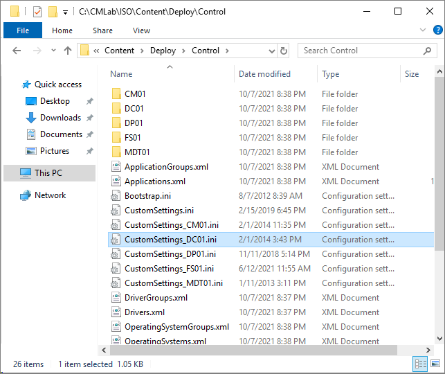

*The configuration files for the Hydration Kit.*

In addition, for the **ConfigMgr (CM01)** VM you need to update the following file:

- C:\CMLab\DS\Applications\Install - ConfigMgr\ConfigMgrUnattend.ini

If you need to change the various service accounts, you need to to modify the **Configure-CreateADStructure.wsf** script in the
**C:\CMLab\DS\Applications\Configure - Create AD Structure** folder.

### Customizing with a script

With a huge thanks to [Matt Benninge](https://www.deploymentresearch.com/author/matbg/), a customization script called [CustomizeHydrationKit.ps1](https://github.com/DeploymentResearch/HydrationKitWS2022/blob/main/CustomizeHydrationKit.ps1) has been updated and added to the Server 2022 kit for the first time! This script assists in changing many of the customizable parameters of the Hydration Kit, including IP addresses, domain name, time zone, and passwords.

In addition, the script will make a copy of the original configuration so that you can easily revert your changes. Upon rerunning the script on a customized Deployment Share, the script will revert all files to the original copies before applying your changes again.

*Written by Johan Arwidmark*
